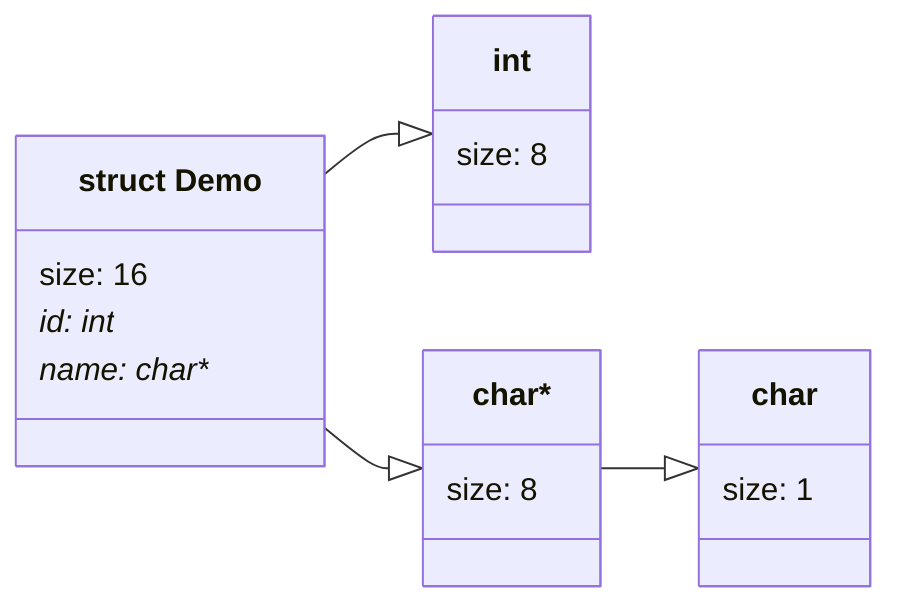

+++
title = "Visual Debugger"
date = "2022-06-25"
description = "Better tools for teaching compiled languages"
+++

## Why Another Debugger?

The first programming language I really got comfortable with was Java. It was
good for learning in high school because its object oriented-ness makes it
pretty easy to build a mental model for how Java works internally. That's not to
say that there aren't weird quirks like the integer object cache, but on the
whole, Java code and data can be broken down into easy to understand models. For
AP Computer Science, my teacher used this to create a visual models of running
programs on the whiteboard, and manipulate them to demonstrate code execution.

```Java
public class Main {
    public static class Demo {
        public int id;
        public String name;
        public Object data;
    }
    public static void main(String[] args) {
        Demo[] demos = new Demo[1];
        demos[0] = new Demo();
        demos[0].id = 10;
        demos[0].name = "Hello Demo";
        demos[0].data = demos[0].name;
        System.out.format("%d, %s, %h", demos[0].id, demos[0].name, demos[0].data);
    }
}
```

{{ captioned_image(caption="IntelliJ Debugger view of the demo program", src="Java Debugger Demo.png") }}

```C
struct Demo {
    int id;
    char* name;
    void* data;
};

void main(int argc, char* argv[]) {
    struct Demo demos[1];
    demos[0].id = 10;
    demos[0].name = "Hello Demo";
    demos[0].data = &demos[0].name;
    printf("%d %s %p", demos[0].id, demos[0].name, demos[0].data);
}
```

[TODO: use this tutorial to build this site](https://www.youtube.com/watch?v=p0bGHP-PXD4)

This project is an attempt to create the kind of tooling I've come to appreciate
when working with Java, but for compiled languages, especially simple C
programs. Learning C and GDB at the same time just isn't very fun.

Thankfully, compilers can generate extremely rich metadata to describe the
programs they take as input. This debug information can then be processed by a
debugger to reproduce many of the high level concepts I think about when
programming, especially information about types.

## DWARF

One standardized format for debug information is DWARF, which is widely used on
Linux platforms. The `dwarfdump` utility can be used to parse and visualize
DWARF information in a textual format like so:

This part of the DWARF information describes the `stdout` global variable in a C
program, where it is declared in main.c, and its type information.

DWARF consists of a list of entries that can be referenced by file offset.
`dwarfdump` lists entries like this

<!-- markdownlint-disable-next-line fenced-code-language -->
```text
 <[tree depth]><[file offset]>: Abbrev Number [tag number] ([tag description])
    <[file offset]>              [attribute description] : [attribute value]
```

The entries that describe `struct Demo` consist of a `DW_TAG_structure_type`
entry, and two `DW_TAG_member` child entries. The first number in the entry
indicates the tree depth.

```dwarfdump
 <1><79>: Abbrev Number: 9 (DW_TAG_structure_type)
    <7a>   DW_AT_name        : (indirect string, offset: 0x0): Demo
    <7e>   DW_AT_byte_size   : 24
    <7f>   DW_AT_decl_file   : 1
    <80>   DW_AT_decl_line   : 3
    <81>   DW_AT_decl_column : 8
    <82>   DW_AT_sibling     : <0xa9>
 <2><86>: Abbrev Number: 10 (DW_TAG_member)
    <87>   DW_AT_name        : id
    <8a>   DW_AT_decl_file   : 1
    <8b>   DW_AT_decl_line   : 4
    <8c>   DW_AT_decl_column : 9
    <8d>   DW_AT_type        : <0x5a>
    <91>   DW_AT_data_member_location: 0
 <2><92>: Abbrev Number: 3 (DW_TAG_member)
    <93>   DW_AT_name        : (indirect string, offset: 0xa5): name
    <97>   DW_AT_decl_file   : 1
    <97>   DW_AT_decl_line   : 5
    <98>   DW_AT_decl_column : 11
    <98>   DW_AT_type        : <0x68>
    <9c>   DW_AT_data_member_location: 8
 <2><9d>: Abbrev Number: 3 (DW_TAG_member)
    <9e>   DW_AT_name        : (indirect string, offset: 0xaa): data
    <a2>   DW_AT_decl_file   : 1
    <a2>   DW_AT_decl_line   : 6
    <a3>   DW_AT_decl_column : 11
    <a3>   DW_AT_type        : <0x3c>
    <a7>   DW_AT_data_member_location: 16
...
```

Each then refers to other entries, creating a graph of types. Primitive types can
be parsed without looking up any other entries, and have their size and numeric
type recorded.

```dwarfdump
 <1><5a>: Abbrev Number: 7 (DW_TAG_base_type)
    <5b>   DW_AT_byte_size   : 4
    <5c>   DW_AT_encoding    : 5    (signed)
    <5d>   DW_AT_name        : int
```



## Unique Challenges

This isn't too bad for simple structures, but type entries don't necessarily
have consistent attributes, making them hard to parse. For example, GCC does not
emit a name for the void* type, but instead just creates an entry with no
information besides the size.

```dwarfdump
 <1><79>: Abbrev Number: 8 (DW_TAG_pointer_type)
    <7a>   DW_AT_byte_size   : 8
```

The project is currently stalled on this problem *"how do I write a parser with
far too many edge cases?"*, and while I have gone through several revisions to
make the code more ergonomic to write, I still haven't really found a good
solution.

The current implementation is a recursive descent parser that does some
normalization to remove edge cases. All entries are converted to a
`DebugInfoEntry` mega-structure to provide easy access to each property.

Note that the only non optional fields are the tag and offset, which are
critical components of the debug entry data structure that cannot possibly be
ommitted. Size in bytes is not guaranteed because some types' sizes are not
evenly divisible by 8 bits.

```Rust
#[derive(Debug, PartialEq, Clone)]
struct DebugInfoEntry {
    pub offset: gimli::UnitOffset,
    pub tag: gimli::DwTag,
    pub name: Option<String>,
    pub byte_size: Option<u64>,
    pub bit_size: Option<u64>,
    pub size: Option<u64>,
    pub type_ref: Option<gimli::UnitOffset>,
    // pub has_children: bool,
    pub children: Option<Vec<gimli::UnitOffset>>,
    pub sibling_ref: Option<gimli::UnitOffset>,
    pub low_pc: Option<u64>,
    pub high_pc: Option<u64>,
    pub encoding: Option<gimli::DwAte>,
    pub decl_line: Option<u64>,
    pub decl_column: Option<u64>,
    pub decl_file: Option<String>,
    pub data_member_location: Option<u64>,
    pub upper_bound: Option<u64>,
    pub is_external: Option<bool>,
    pub is_declaration: Option<bool>,
    pub is_prototyped: Option<bool>,
    pub frame_base: Option<abbr::Expression>,
}
```
